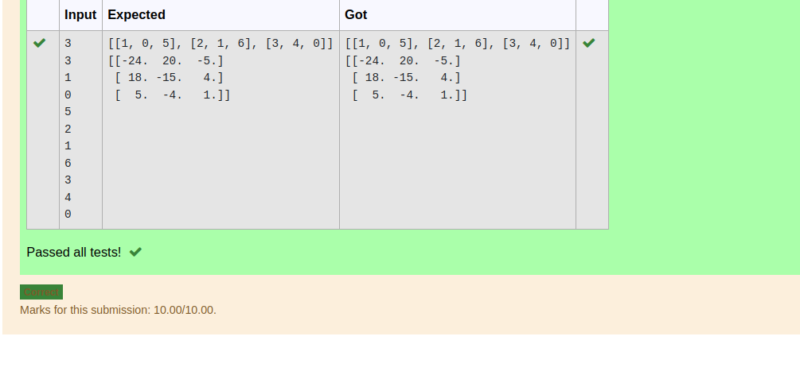

# Inverse-of-matrix

## AIM:
To write a python program to find the inverse of a nested array.

## ALGORITHM:
### Step 1:
Import numpy as np.
### Step 2:
Create an empty lists.
### Step 3:
Get the values from the user as input.
### Step 4:
Inverse the matrix using linalg library
### Step 5:
Display the result.


## PROGRAM:
```python
'''
Developed by:Saileshkumar A
Register number:22003843
'''
import numpy as np
n=int(input())
m=int(input())
l1=[]
l2=[]
for i in range(n):
    for j in range(m):
        l1.append(int(input()))
    l2.append(l1)
    l1=[]
print(l2)
print(np.linalg.inv(l2))
```

## OUTPUT:


## RESULT:
Display the result.

